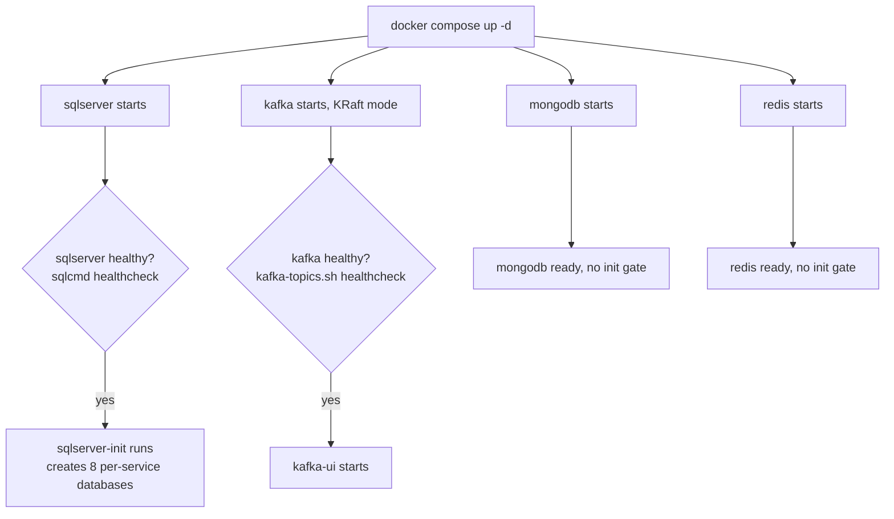
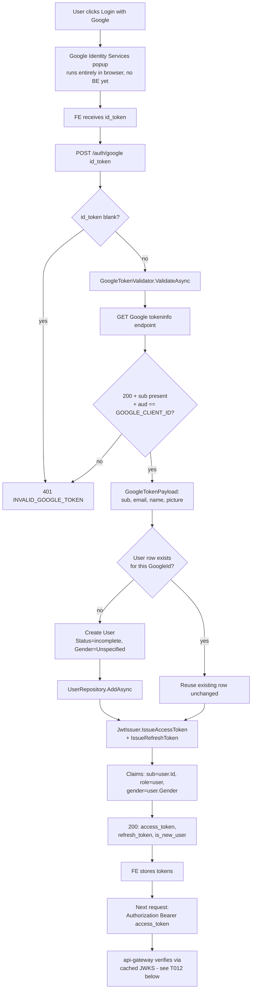
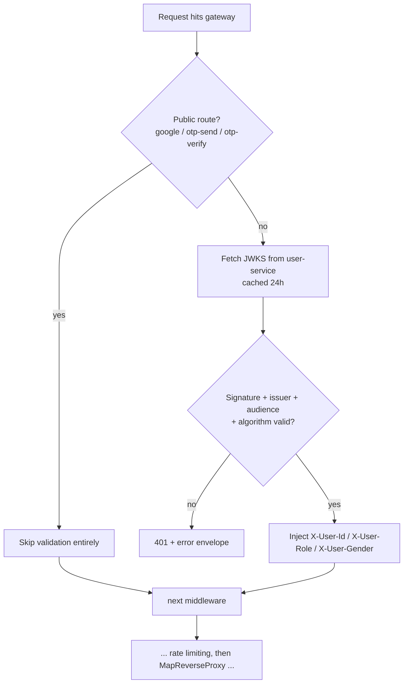
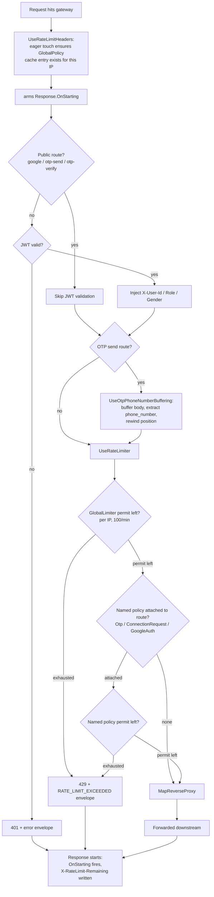
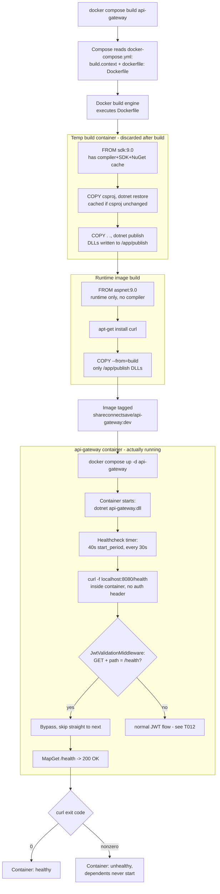
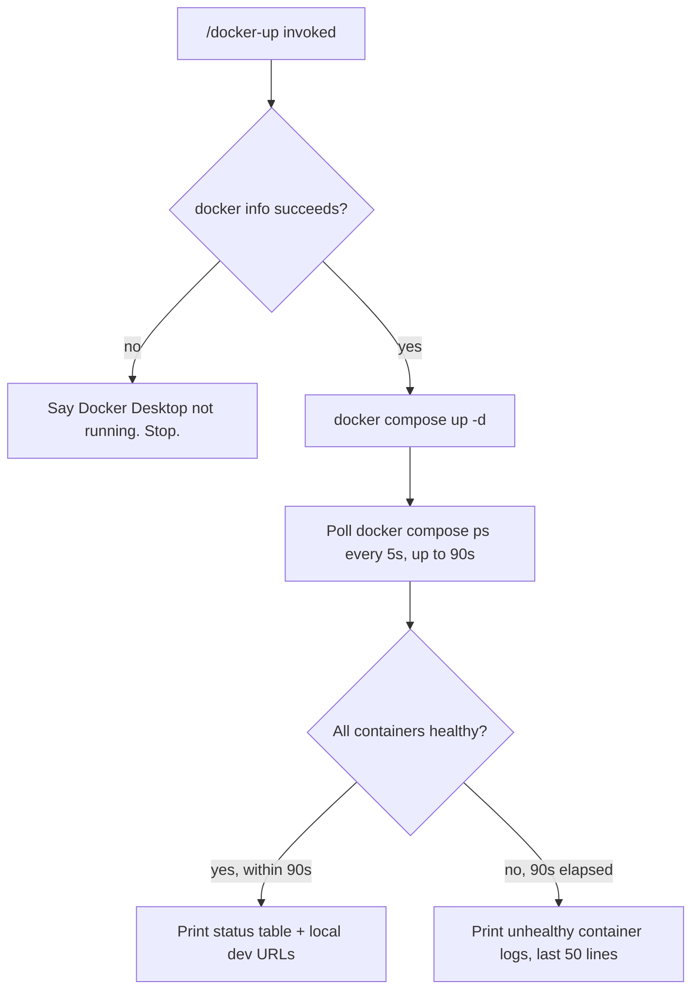

# Workflows

Quick-glance boxes-and-arrows reference for how a request actually flows through the code.
No prose — if you need the "why," see the ticket file or `README.md`'s concepts section.
Generated/updated via `/diagram-task T0XX`.

## Contents

- [T004 — Docker Compose Infrastructure](#t004--docker-compose-infrastructure)
- [T016 — Google OAuth + JWT Issuance](#t016--google-oauth--jwt-issuance)
- [T012 — JWT Validation Middleware](#t012--jwt-validation-middleware)
- [T013 — Rate Limiting Middleware](#t013--rate-limiting-middleware)
- [T014 — Gateway Docker Image](#t014--gateway-docker-image)
- [/docker-up command flow](#docker-up-command-flow)

---

## T004 — Docker Compose Infrastructure

`depends_on: condition: service_healthy` is the gate — a dependent container's own start is blocked until Docker reports the healthcheck passing, not just "container running."

---

## T016 — Google OAuth + JWT Issuance

RSA keypair is loaded/generated once when `JwtIssuer` is constructed (singleton, app startup) — never per-request or per-issue-call; a new token just reuses the same key.

---

## T012 — JWT Validation Middleware

---

## T013 — Rate Limiting Middleware

GlobalLimiter and any named policy are checked independently — both must have a permit, not either/or. The eager touch in step B (added after review found 401s missing the header) is what makes the header land on Z1 too, since GlobalPolicy's cache entry no longer depends on reaching UseRateLimiter first.

---

## T014 — Gateway Docker Image

SG1's container is compile-only and thrown away — nothing in it reaches the tagged image except the DLLs copied out at G. SG3 is the only container that's actually "the api-gateway" a developer thinks of as running; it's spun up fresh from the image, minutes or builds after SG1 ever existed. Before the `/health` bypass, branch M hit "no", got 401'd by its own gateway, and the container sat unhealthy forever.

---

## /docker-up command flow

