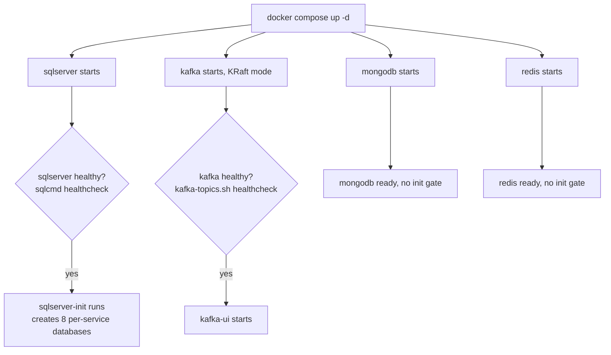
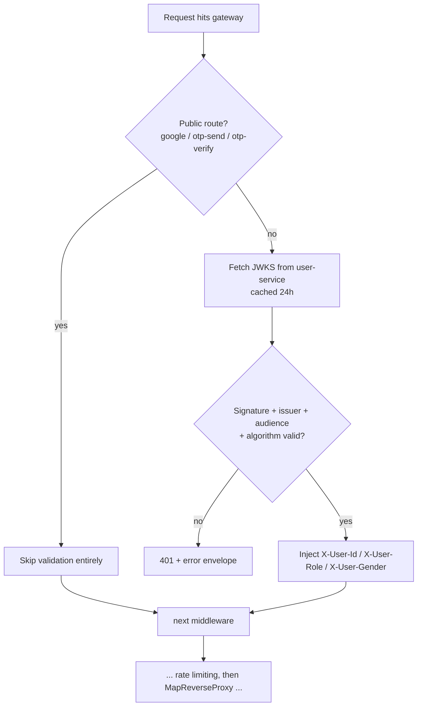
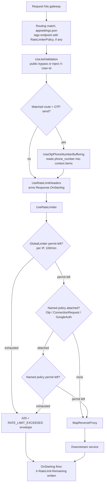
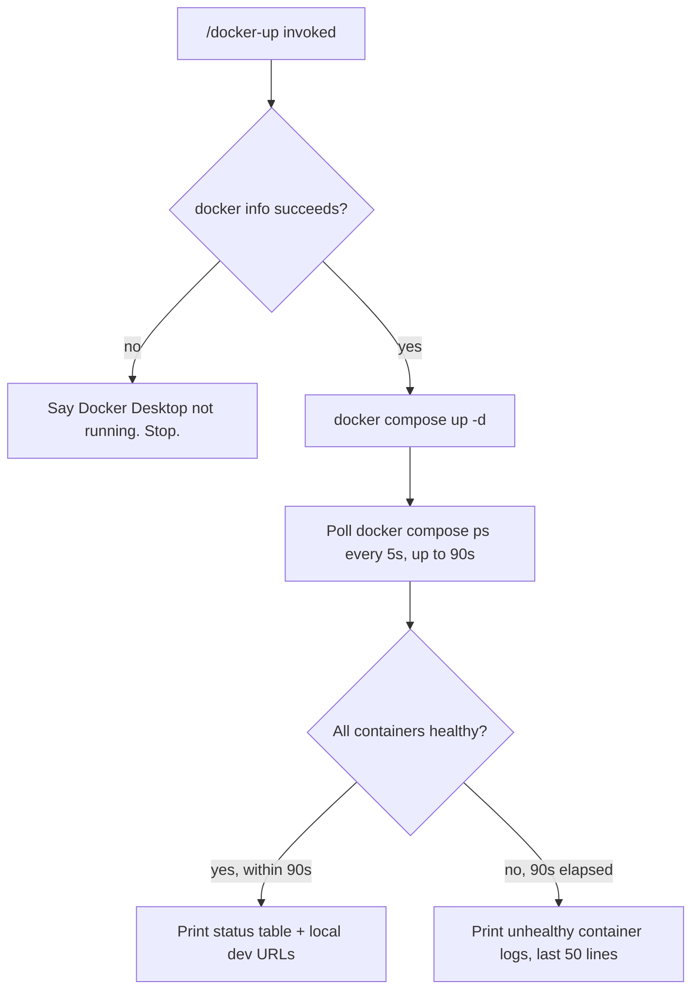

# Workflows

Quick-glance boxes-and-arrows reference for how a request actually flows through the code.
No prose — if you need the "why," see the ticket file or `README.md`'s concepts section.
Generated/updated via `/diagram-task T0XX`.

## Contents

- [T004 — Docker Compose Infrastructure](#t004--docker-compose-infrastructure)
- [T012 — JWT Validation Middleware](#t012--jwt-validation-middleware)
- [T013 — Rate Limiting Middleware](#t013--rate-limiting-middleware)
- [/docker-up command flow](#docker-up-command-flow)

---

## T004 — Docker Compose Infrastructure

`depends_on: condition: service_healthy` is the gate — a dependent container's own start is blocked until Docker reports the healthcheck passing, not just "container running."

---

## T012 — JWT Validation Middleware

---

## T013 — Rate Limiting Middleware

GlobalLimiter and the named policy are checked independently — both must have a permit, not either/or.

---

## /docker-up command flow

