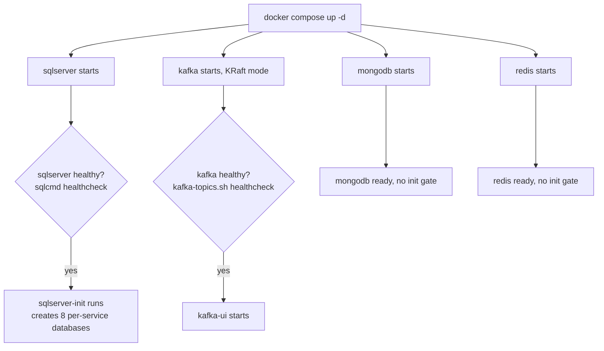

# T004 — Docker Compose Infrastructure

Quick-glance boxes-and-arrows reference for how a request/process actually flows through
the code. No prose — if you need the "why," see the ticket file or `README.md`'s concepts
section. Generated/updated via `/diagram-task T0XX`.

`depends_on: condition: service_healthy` is the gate — a dependent container's own start is blocked until Docker reports the healthcheck passing, not just "container running."
