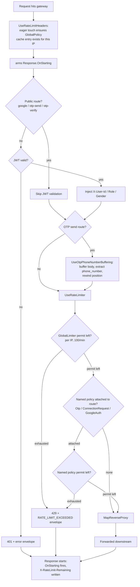

# T013 — Rate Limiting Middleware

Quick-glance boxes-and-arrows reference for how a request/process actually flows through
the code. No prose — if you need the "why," see the ticket file or `README.md`'s concepts
section. Generated/updated via `/diagram-task T0XX`.

GlobalLimiter and any named policy are checked independently — both must have a permit, not either/or. The eager touch in step B (added after review found 401s missing the header) is what makes the header land on Z1 too, since GlobalPolicy's cache entry no longer depends on reaching UseRateLimiter first.
