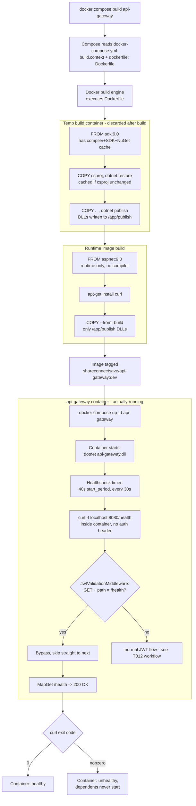

# T014 — Gateway Docker Image

Quick-glance boxes-and-arrows reference for how a request/process actually flows through
the code. No prose — if you need the "why," see the ticket file or `README.md`'s concepts
section. Generated/updated via `/diagram-task T0XX`.

SG1's container is compile-only and thrown away — nothing in it reaches the tagged image except the DLLs copied out at G. SG3 is the only container that's actually "the api-gateway" a developer thinks of as running; it's spun up fresh from the image, minutes or builds after SG1 ever existed. Before the `/health` bypass, branch M hit "no", got 401'd by its own gateway, and the container sat unhealthy forever.
