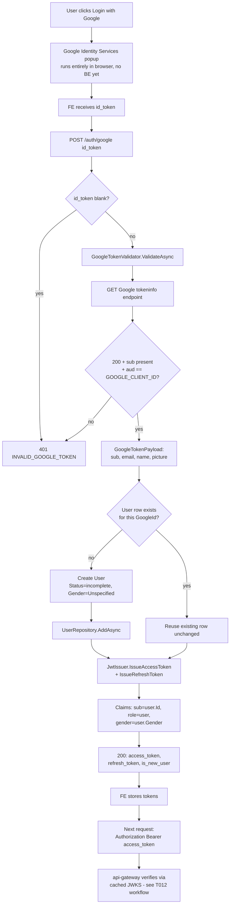

# T016 — Google OAuth + JWT Issuance

Quick-glance boxes-and-arrows reference for how a request/process actually flows through
the code. No prose — if you need the "why," see the ticket file or `README.md`'s concepts
section. Generated/updated via `/diagram-task T0XX`.

RSA keypair is loaded/generated once when `JwtIssuer` is constructed (singleton, app startup) — never per-request or per-issue-call; a new token just reuses the same key.
