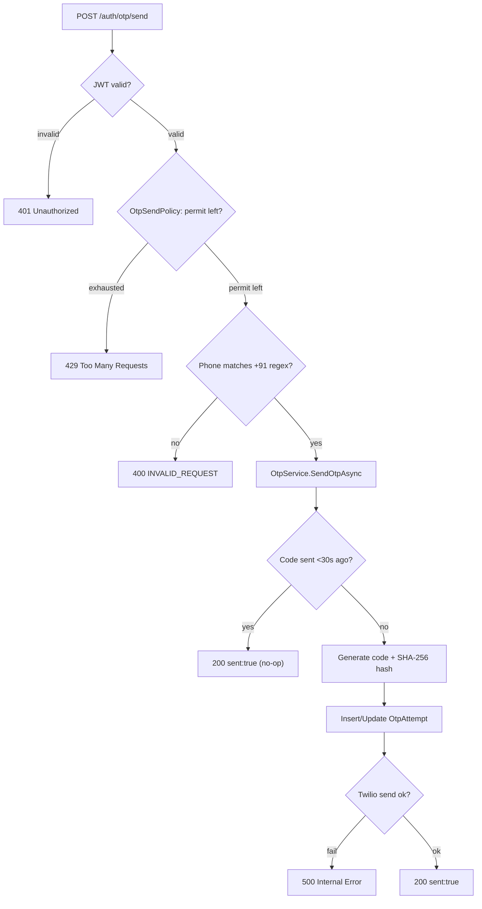
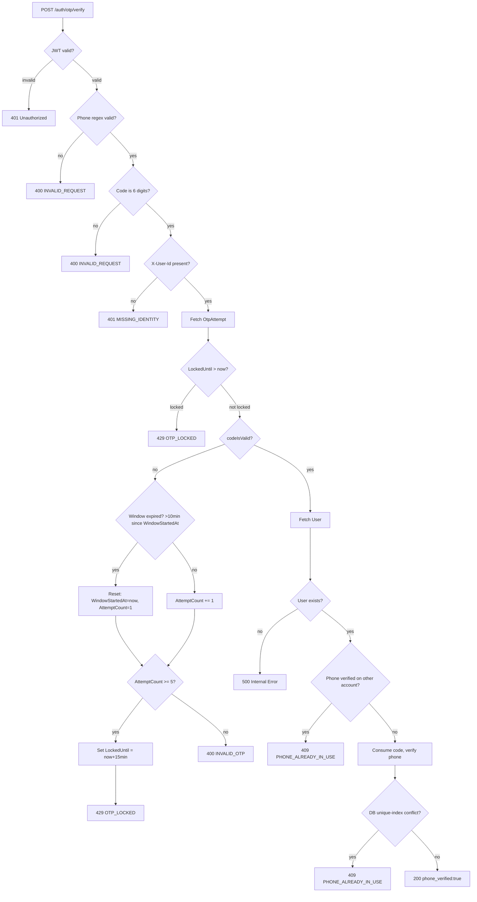

# T017 — Phone OTP Verification

Quick-glance boxes-and-arrows reference for how a request/process actually flows through
the code. No prose — if you need the "why," see the ticket file or `README.md`'s concepts
section. Generated/updated via `/diagram-task T0XX`.

## Send — `POST /auth/otp/send`

`ResendCooldownSeconds`(30s) and `CodeExpiryMinutes`(5min) are different windows — cooldown gates resend, expiry gates verify.

## Verify — `POST /auth/otp/verify`

Phone conflict is checked twice — a fast-path read (M) then the DB's own unique index (O) — only O is the real guarantee.
