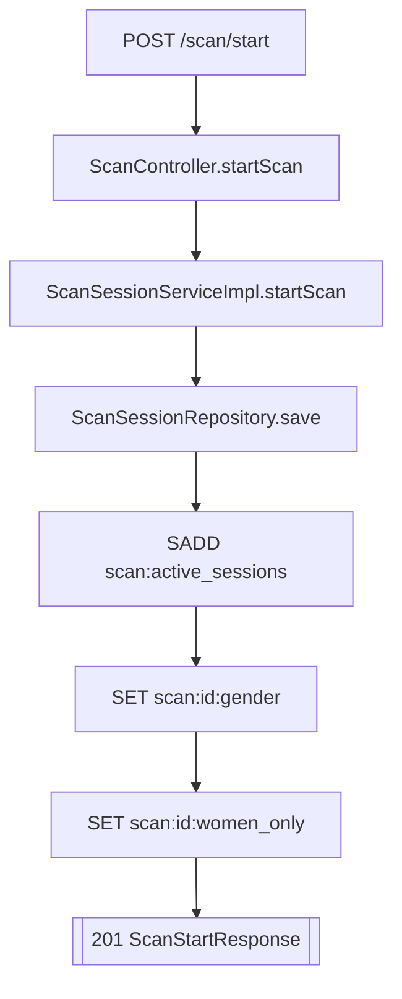
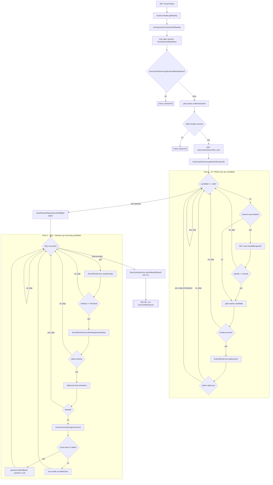

# T023 — GPS Discovery Query

Quick-glance flow diagram — what calls what, in what order, where it branches. Not
documentation; see `.claude/tickets/T023.md` and code comments for the "why."

### `POST /scan/start`

`PUT /scan/location` → `ScanSessionServiceImpl.updateLocation` → `SET scan:id:location EX 30s` — runs continuously for every session, independent of women_only.

### `GET /scan/nearby`

Pass 1 only ever touches Redis (never SQL); SQL's `findAllById` only ever sees candidate ids Pass 1 already kept.
