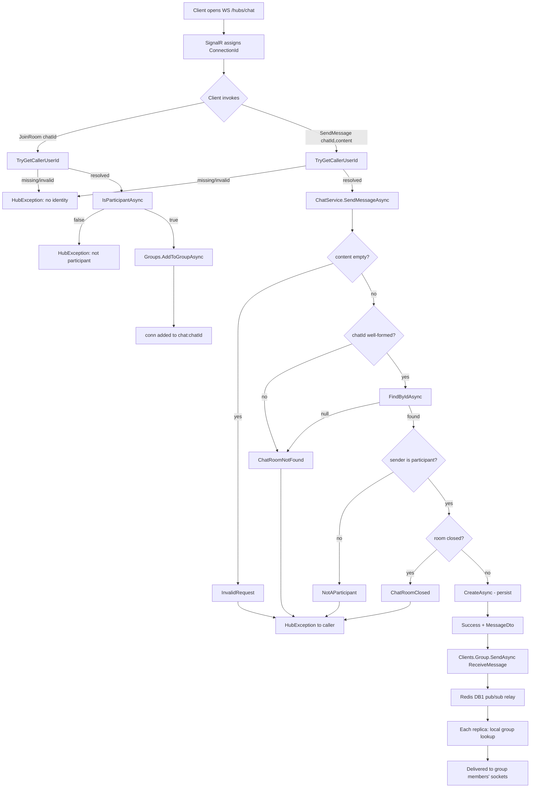

# T036 — SignalR Hub + Real-time Messaging

Quick-glance flow diagram — what calls what, in what order, where it branches. Not
documentation; see `.claude/tickets/T036.md` and code comments for the "why."

Upstream of node A, nothing yet creates the `chat_room` document itself — that's T038
(Kafka Consumer: connection.accepted), not implemented as of this diagram; every path
above assumes a `chatId` that already exists.
