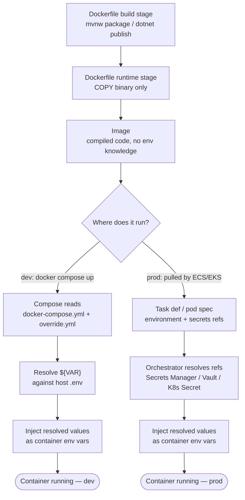

# Docker Env & Secrets — Build vs Runtime, Dev vs Prod

Quick-glance boxes-and-arrows reference for how a request/process actually flows through
the code. No prose — if you need the "why," see T004/T014/T020/T025/T028's ticket files or
`README.md`'s concepts section. Generated/updated via `/diagram-task`.

Build stage (`docker compose build`) never reads `.env` or `environment:` — that block only matters at container start, and the image is identical whether it ends up on the dev or prod branch.
