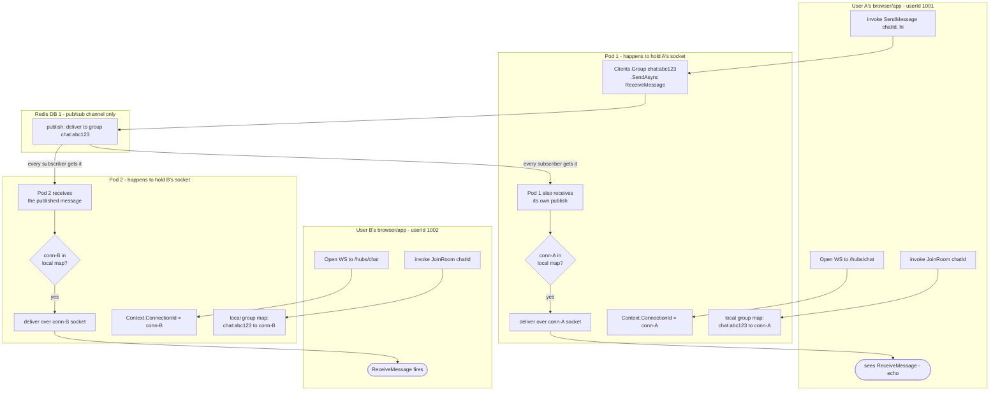

# SignalR Redis Backplane — Multi-User, Multi-Pod Fan-out

Quick-glance boxes-and-arrows reference for how a request/process actually flows through
the code. No prose — if you need the "why," see `T036`'s workflow/ticket or the
conversation that produced this diagram.

Redis never stores WHO is in a group — it only relays "something was sent to group
chat:abc123" to every pod; each pod decides for itself, from its own local in-memory map,
whether it holds any sockets that belong in that group.
